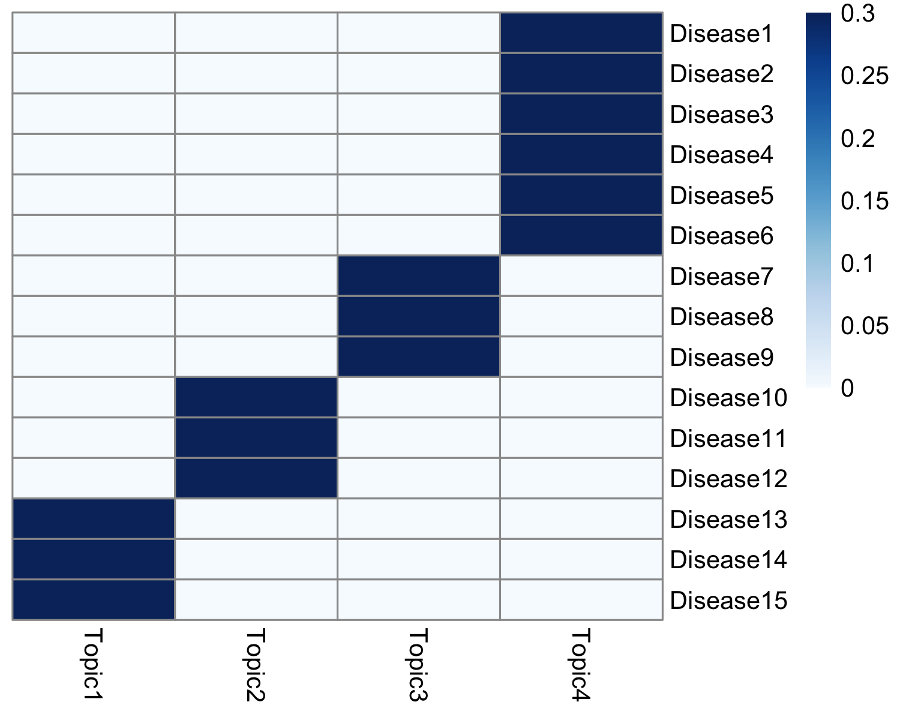
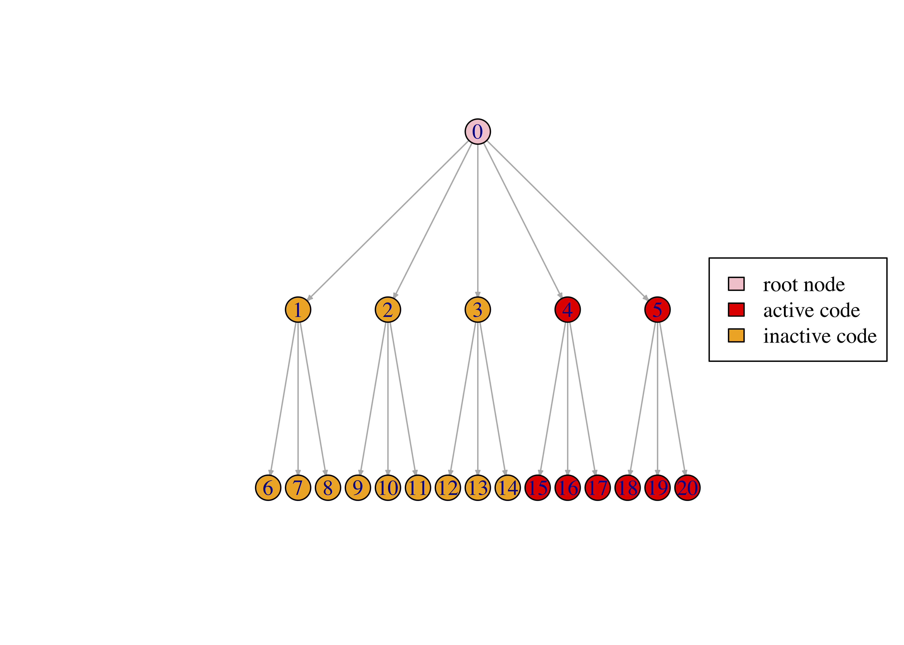

<style type="text/css">
  body{
  font-size: 12pt;
}
</style>


```{r setup, include=FALSE}
knitr::opts_chunk$set(echo=FALSE,warning=FALSE,message=FALSE)
```


treeLFA is a topic model based on Bayesian binary non-negative matrix factorization, and is used to infer 
topics of disease codes from binary diagnosis data. This tutorial gives an example of running treeLFA on a
small simulated dataset. 
Firstly, load the libraries and source the scripts: 
```{r,echo=TRUE}
library(data.table)
library(dplyr)
library(Rcpp)
library(RcppParallel)
library(pheatmap)
library(RColorBrewer)

Rcpp::sourceCpp("treeLFA.ge.new.cpp")
Rcpp::sourceCpp("treeLFA.g.new.cpp")
Rcpp::sourceCpp("pl_mc.cpp")
source(file="treeLFA.functions.R")
```

There are two inputs for treeLFA: the diagnosis data for individuals, and the tree structure of disease codes. 
The diagnosis data is a bianry matrix in which the presence and absence of disease codes for individuals are 
recorded. Each row in the input matrix is an individual, and each column is a disease code. The example dataset contains the diagnostic record of 15 disease codes for 5,000 individuals. 
```{r, echo=TRUE}
data <- fread("simu.train.data.txt")    
print(head(data))
```

The input data for treeLFA is simulated using the generative process of treeLFA and four topics. The heatmap 
below shows the four topics, where each row is a disease code and each column is a topic. Each topic is a 
vector of probabilities for the 15 disease codes. 

```{r, out.width="40%"}

```

The schematic of the tree structure for the 15 disease codes is shown below. There are 5 internal nodes on the 
2nd layer of the tree, and 15 terminal nodes on the bottom layer (each corresponds to a disease code). Each 
node on the 2nd layer has 3 children nodes on the bottom layer. The active codes in the 4th topic above are 
highlighted in red: 

```{r, out.width="40%"}

```

The tree structure of disease codes is stored in a table in which the parent code for each code on the tree is 
recorded.
```{r, echo=TRUE}
tree_str <- fread("tree.str.simu.txt")    
print(head(tree_str,10))
```


With the input data prepared, the Gibbs-EM algorithm can be used to optimize alpha (The hypeparameter of the 
Dirichlet prior for topic weights) while doing the inference of other hidden variables. The number of topics to be inferred (argument "topic.number" in the "gibbs_EM_train" function below) needs to be set. The initial alpha (argument "alpha") is set to be (0.1,0.1,0.1,0.1), which was the true alpha used to simulate the data. On real 
world dataset, it is recommended to set alpha to be (1,0.1,...0.1).   
In addition, the "burn_in" argument denotes the number of Gibbs sampling iterations in each E-step before the 
collection of samples of hidden variables (used for the optimization of alpha in the M-step). There are two 
stages of training. For both stages, the total number of EM cycles (arguements "cycle_1" and "cycle_2") and the
number of hidden variables collected in the E-step can be set (arguement "opt_N_1" and "opt_N_2"). Note that in stage 1, "opt_N_1" is usually set to be 1 to speed up the traniing. In stage 2, "opt_N_2" can be set to a value larger than 1 to achieve more accurate optimization of alpha. The Gibbs-EM training here will take about two 
minutes. 
```{r, echo=TRUE}
ge_result <- gibbs_EM_train( topic.number=4,
                             data,tree_str,
                             burn_in=19, 
                             alpha=c(0.1,0.1,0.1,0.1),
                             opt_N_1=1, cycle_1=1000, 
                             opt_N_2=10, cycle_2=100 )
```
In the result object "ge_result", values of all hidden variables and the hyperparameter alpha in the last cycle
of the Gibbs-EM training are stored. The hidden variables include the probability variables of disease codes in
topics (Phi), the indicator variables of disease codes in topics (I), the transition probability variables of 
the Markov process on the tree structure (rho), and the topic assignment variables for all individuals' disease
codes (Z). The full likelihood of the treeLFA model in all Gibbs-EM cycle are also recorded, and can be plotted
to monitor the convergence. 
```{r pressure, echo=TRUE, out.width="40%"}
plot(1:length(ge_result$L_all),ge_result$L_all,type="line",xlab="Gibbs-EM cycles",ylab="Likelihood (log10))")
```

On very large dataset, the Gibbs-EM training can be divided into sevaral phases. By setting the hidden
variables (Phi, I, rho, Z) and alpha in the Gibbs-EM function, previous training can be continued.
```{r,echo=TRUE}
# ge_result <- gibbs_EM_train( topic.number=4,
#                              data,tree_str,
#                              Phi=ge_result$Phi_samples, 
#                              I=ge_result$I_samples, 
#                              rho=ge_result$rho_samples, 
#                              alpha=ge_result$alpha_samples, 
#                              Z=ge_result$Z_samples,
#                              burn_in=19, 
#                              opt_N_1=1, cycle_1=1, 
#                              opt_N_2=1, cycle_2=1 )
```

With alpha optimized and fixed, Gibbs sampling can be used to collected multiple posterior sampels of hidden 
variables. The number of burn in Gibbs iterations (argument "burn_in"), the total number of Gibbs iterations 
(argument "cycle") and the number of interval iterations while collecting posterior samples (argument 
"interval") need to be set: 
```{r, echo=TRUE}
g_result <- gibbs_train( topic.number=4,
                         data,tree_str,
                         Phi=ge_result$Phi_samples, 
                         I=ge_result$I_samples, 
                         rho=ge_result$rho_samples, 
                         alpha=ge_result$alpha_samples, 
                         Z=ge_result$Z_samples,
                         burn_in=50, cycle=100, interval=10  )
```

Inferred topics can be plotted (the 5th posteior sample of topics) to compare with the true topics shown above:
```{r, echo=TRUE, out.width="40%"}
topics_plot( g_result$Phi_samples[[5]] )      # Use the 5th posterior sample of topics
```


Predictive likelihood (on log10 scale) on the test data can be calcualted as below. The argument "IS" denotes 
the number of monte-carlo samples of topic weights (theta) used. 
```{r, echo=TRUE}
data_test <- fread("simu.test.data.txt")    
pl <- predL( g_result$alpha, g_result$Phi_samples[[1]], data, tree_str, IS=100 )
print(pl)
```
